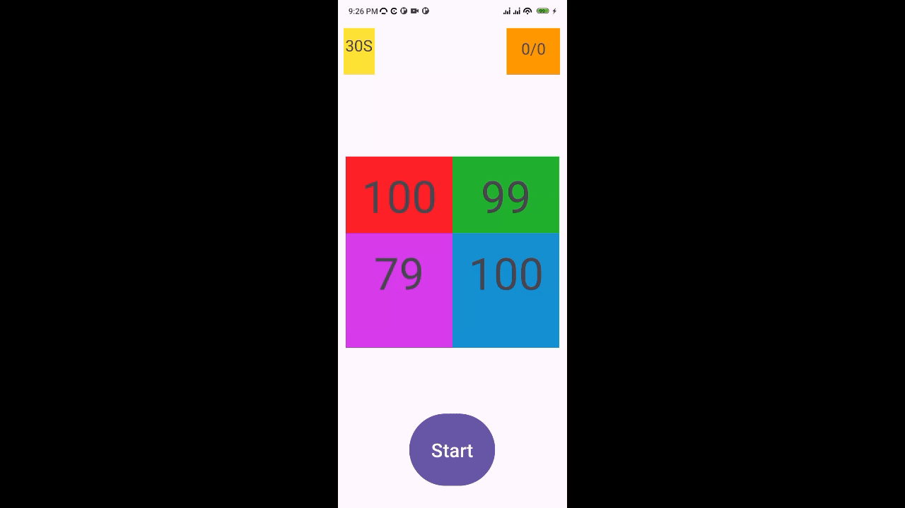

# Brain Trainer

Brain Trainer is an Android app designed to test and improve your arithmetic skills. Users have **30 seconds** to solve as many addition problems as possible, with their score displayed at the end.

## Features

- ⏳ Timed 30-second gameplay.
- ➕ Random addition questions.
- 📊 Score tracking at the end of each round.
- 🎮 User-friendly interface with interactive buttons.

## Demo

  


## Installation

1. Clone this repository:
   ```sh
   git clone git@github.com:roba23/brain-trainer.git
